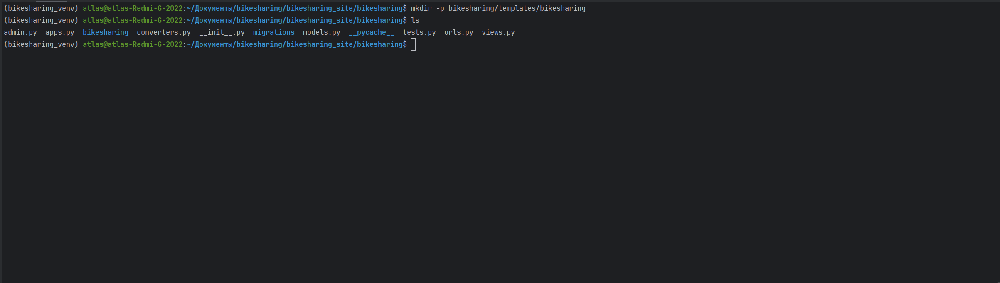
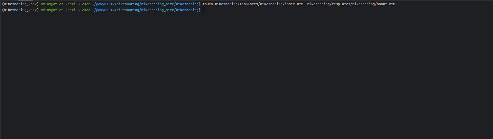
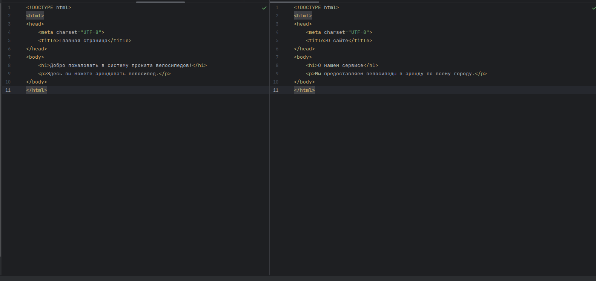
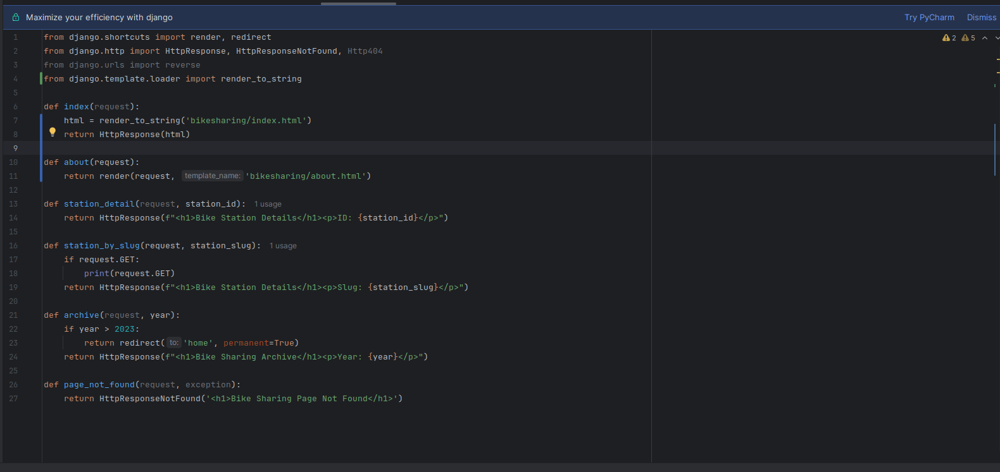
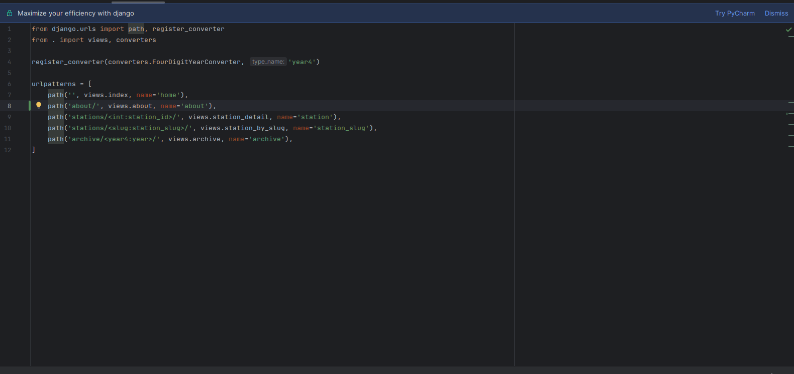
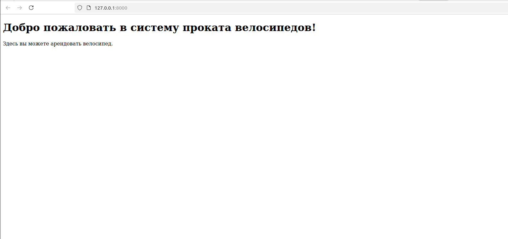
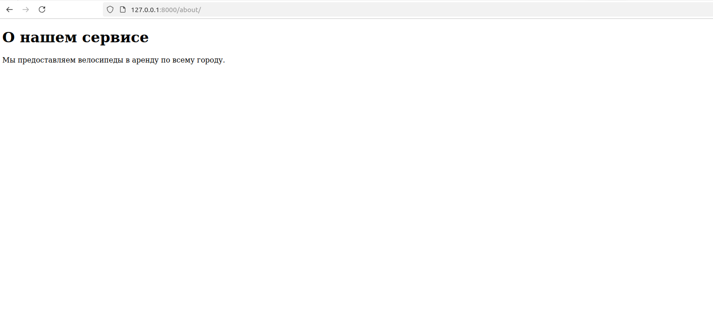

##9
Создаем дополнительную папку, для того чтобы избежать конфликтов имен с шаблонами других приложений.

Создаем файлы шаблонов

Создание базовых шаблонов

Настройка views.py

Настройка urls

Главная страница сайта

Страница "О сайте"

<h1>Настройка шаблонизатора<h1>

