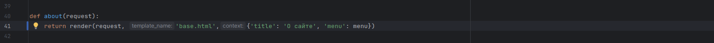
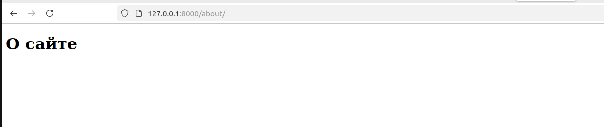
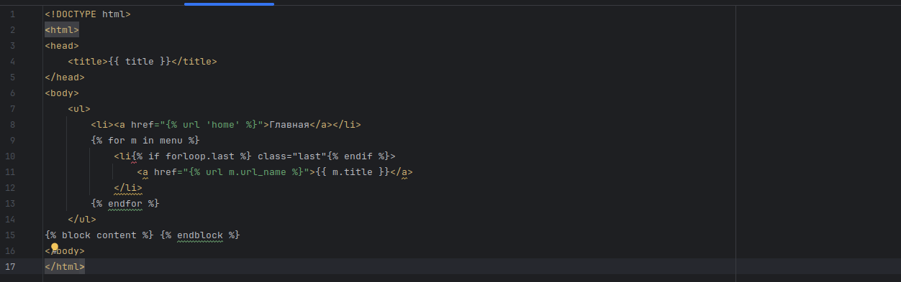
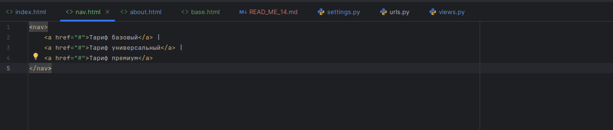

##9
Изменение функции about

Изменение about.html

Страница сайта "О сайте"

Наследование шаблонов

Изменение функции about

Создание папки шаблонов и base.html

Избавлениие от повторяющейся части при помощи шаблонов

Сайт

Добавление блока с меню

Сайт страница about 

Применение шаблона для главной страницы

Теги

Создание тега

Главная страница с тегом

