##9
Создание дополнительных директорий и перемещение в них файлов
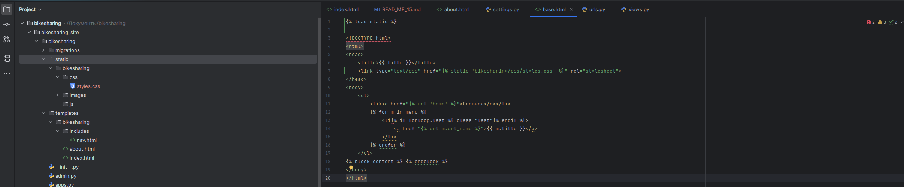

Главная страница с измененным шрифтом
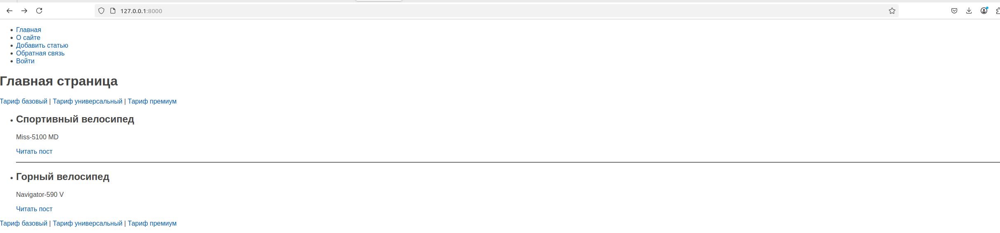

Ограничение выводимых слов до 10
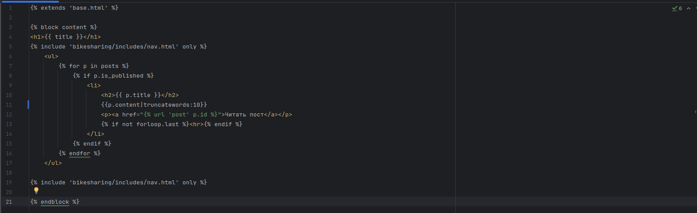

Отображение на сайте
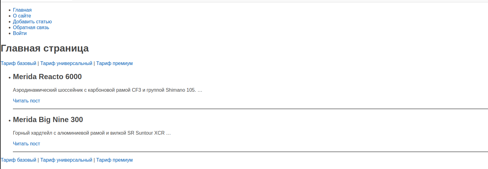

Создание папки шаблонов и base.html
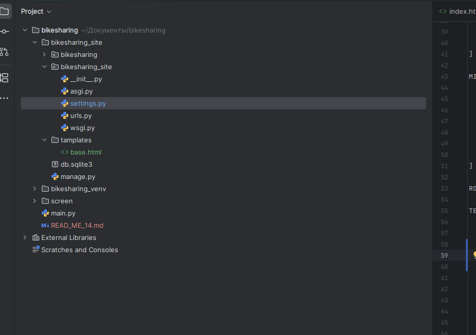

Избавлениие от повторяющейся части при помощи шаблонов
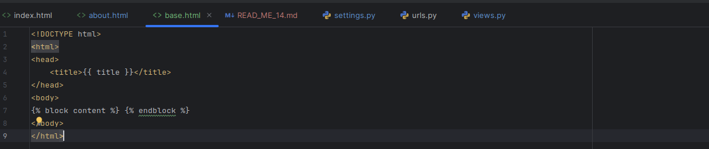
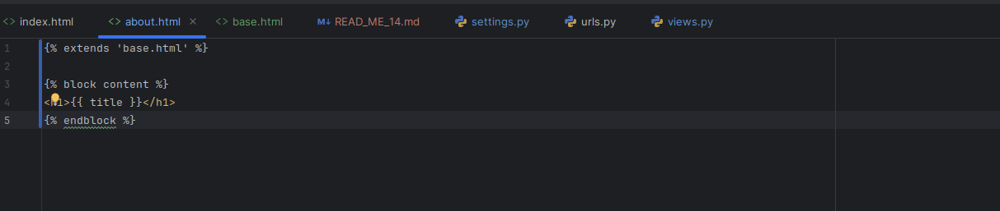

Сайт
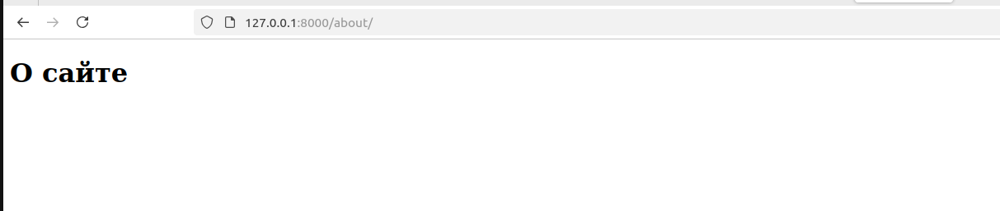

Добавление блока с меню
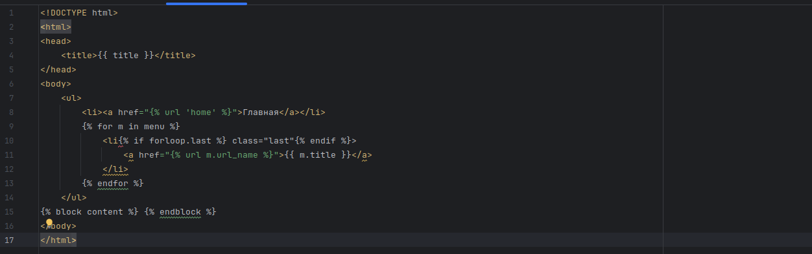

Сайт страница about 
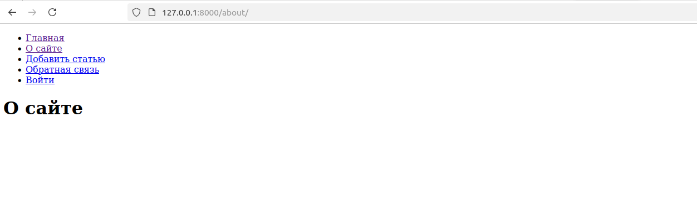

Применение шаблона для главной страницы
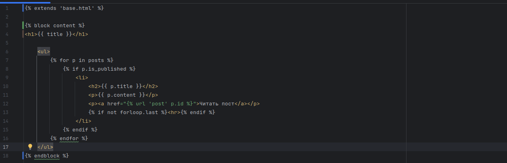

Теги

Создание тега
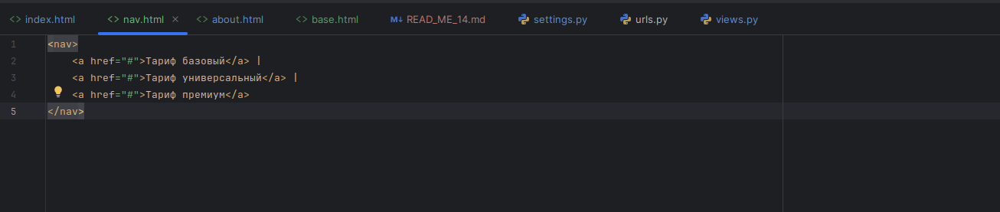

Главная страница с тегом
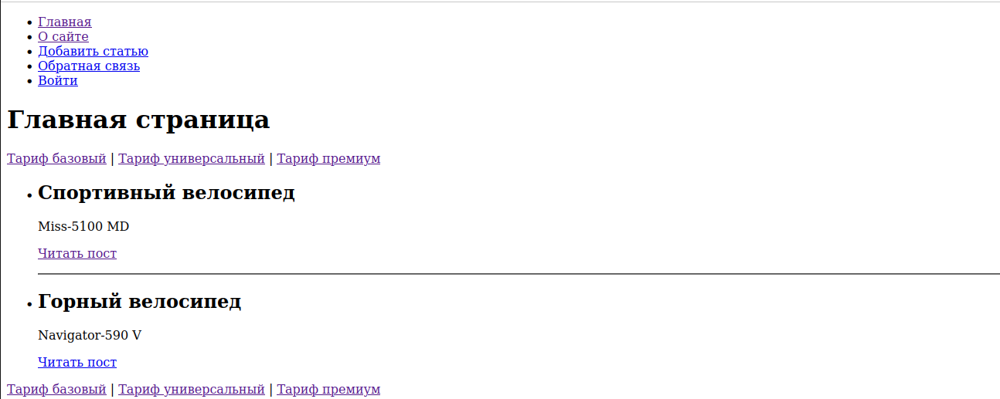
