##9
Создание дополнительной директории templatetags файлов __init__.py dikesharing_tags.py и написание кода в последнем
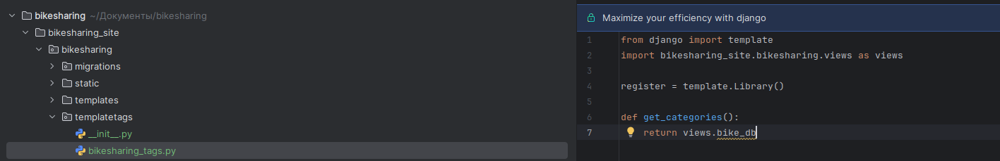

Создание словаря для тега
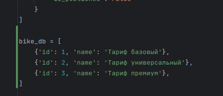

Создание простого тега
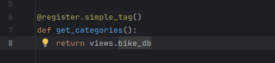

base.html
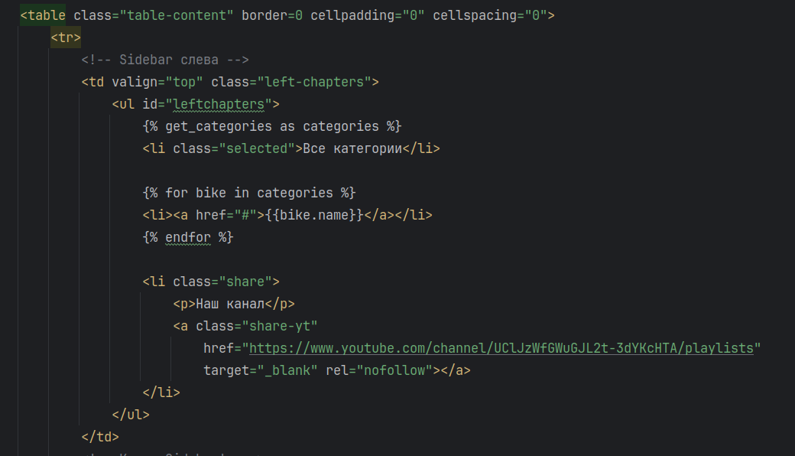

Отображение на сайте
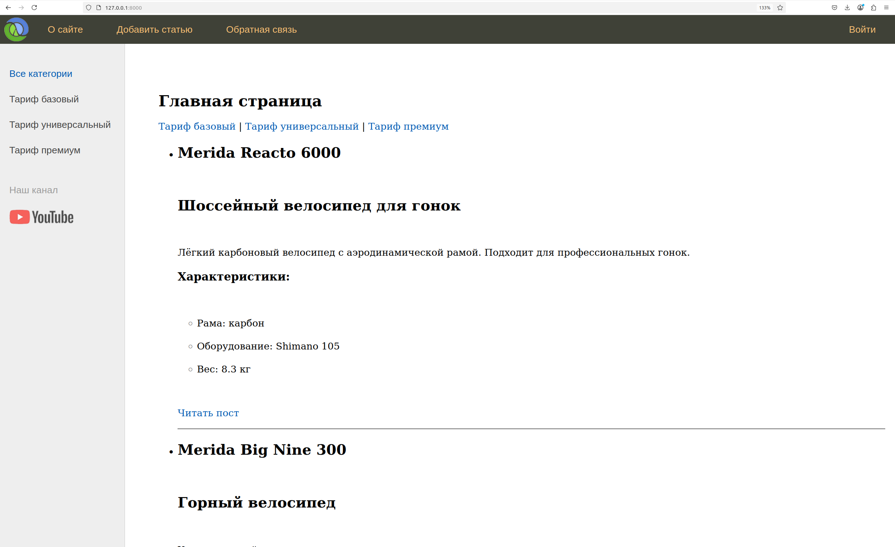

Inclusion Tags

Создание новой функции, которая будет являться включающей категорией
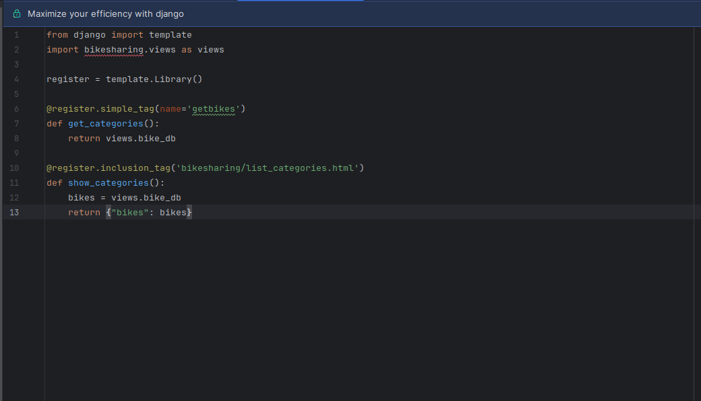

Создание list_categories.html и перенос туда кода из base.html
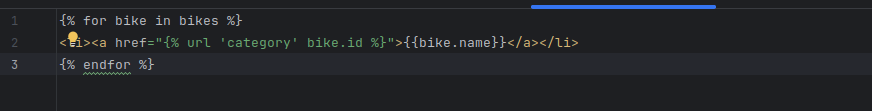

Изменение base.html
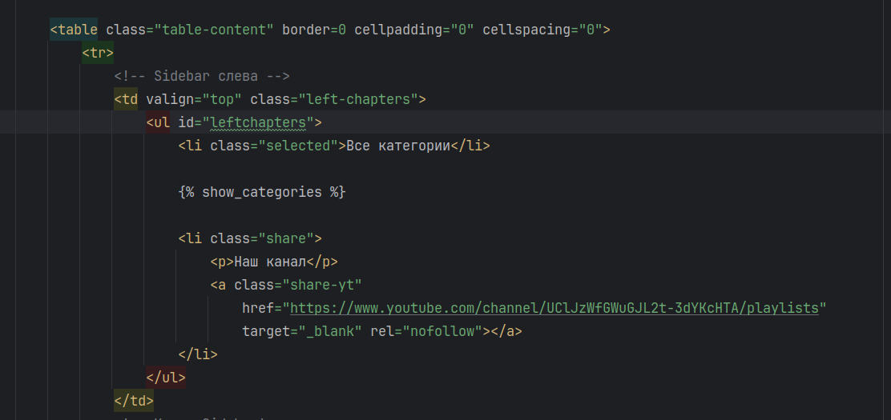

Отображение подсветки ссылок

Изменение base.html
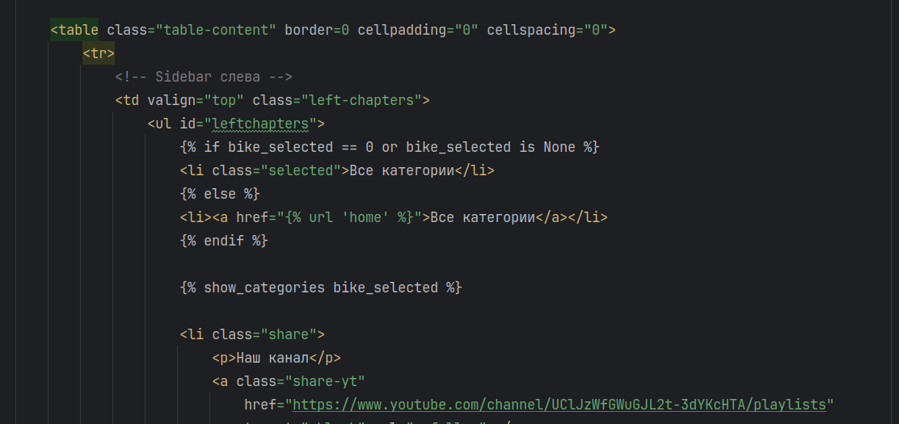

Изменение функции show_categories
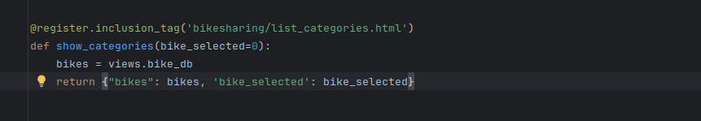

Сайт с подсветкой ссылок
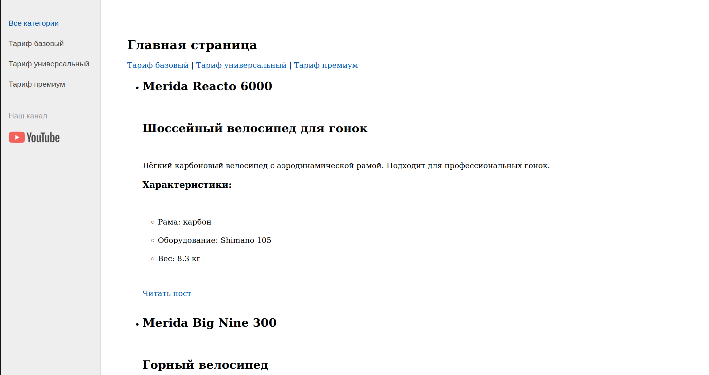