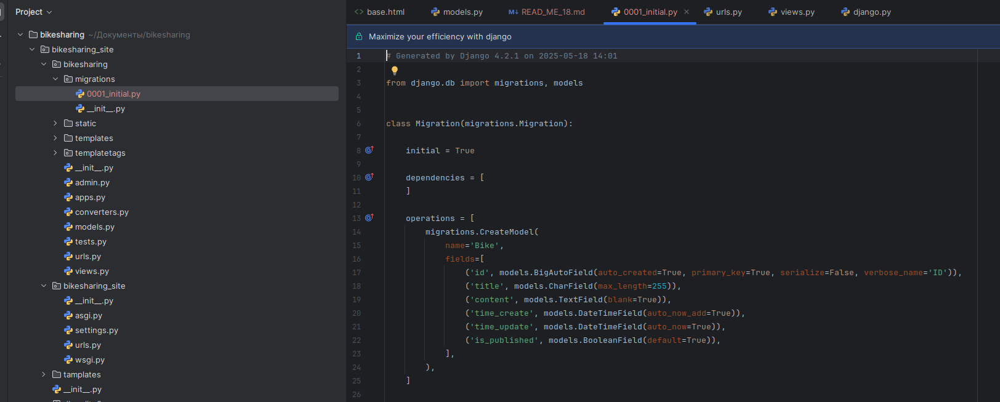

Файл миграции - набор команд для создания базы данных
Джанго самостоятельно создает файлы миграции

Команда для создания миграций

После которой в папке migrations создастся файл 0001_initial.py

Команды для создания SQL запроса и выполнения миграции, второй это более оптимизированный вариант, который автоматизирует всю работу

Результат миграции это создание множества таблиц необходимых для работы сайта
