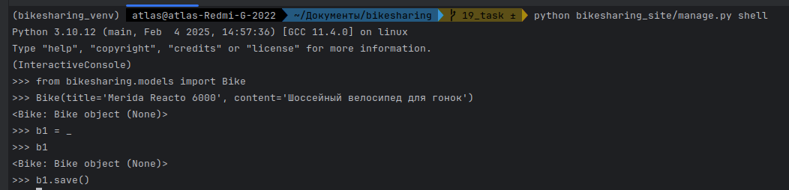
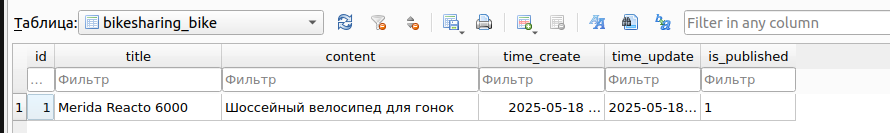
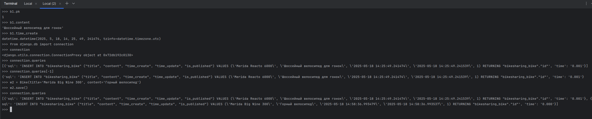
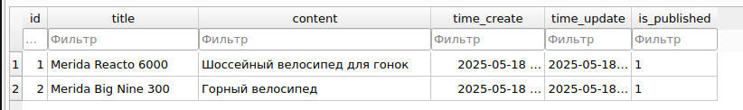
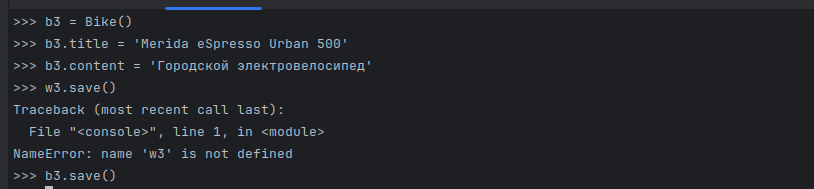
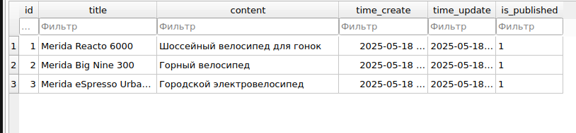
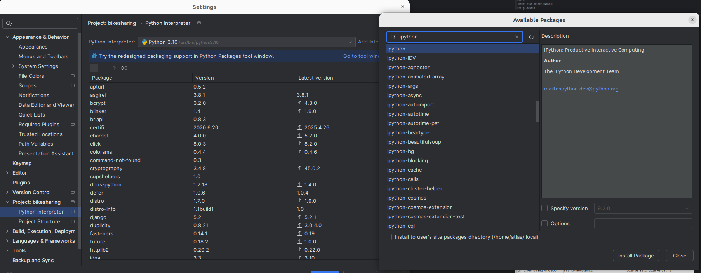
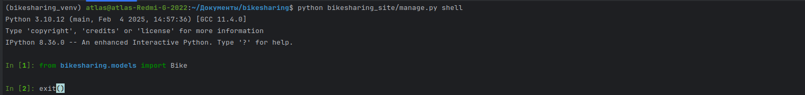
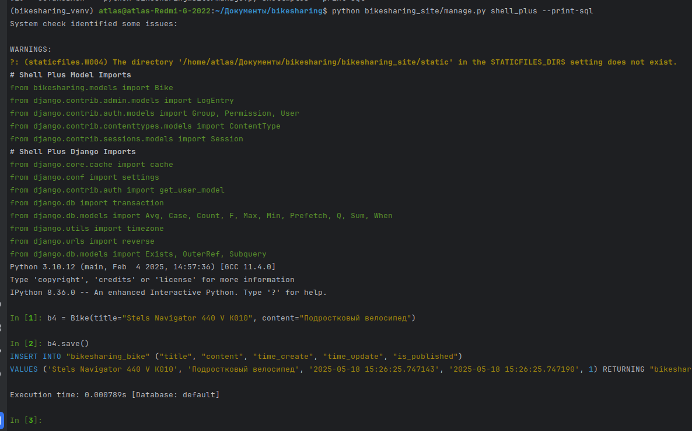

Переход в оболочку
Импорт модели
Заполнение полей сущности
Создание переменной которая будет ссылаться на последний класс
Внесение данных в таблицу

Результат выполненной команды

Команды для отображения id
Отображение контента объекта
Отображение времени создания
Импорт библиотеки для более эффективной работы с БД
Отображение всех запросов
Отображение последнего запроса
Добавление новой сущности

Результат выполненной команды

Создание нового объекта
Заполнение полей
Сохранениев таблицу

Результат выполненной команды

Установка продвинутой оболочки для получения подсказок

Демонстрация удобств ipython
И выход из оболочки

Установка еще одного расширения
pip install django-extensions ipython

Добавление расширения в настройки

При запуске расширения с флагом будут показаны sql запросы
