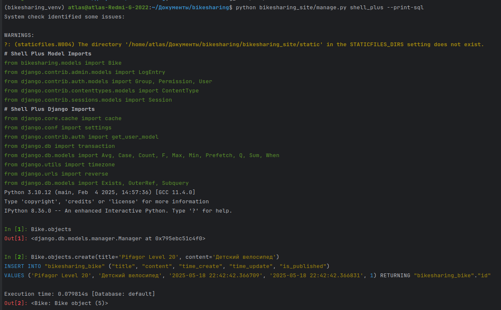
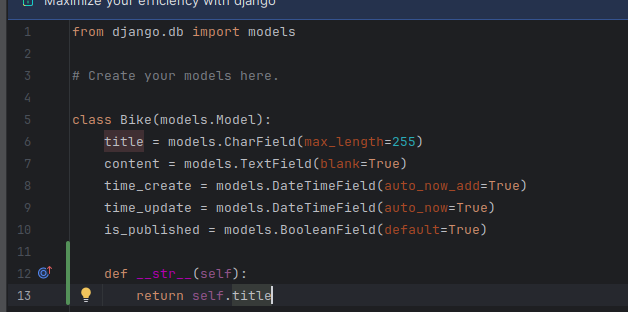
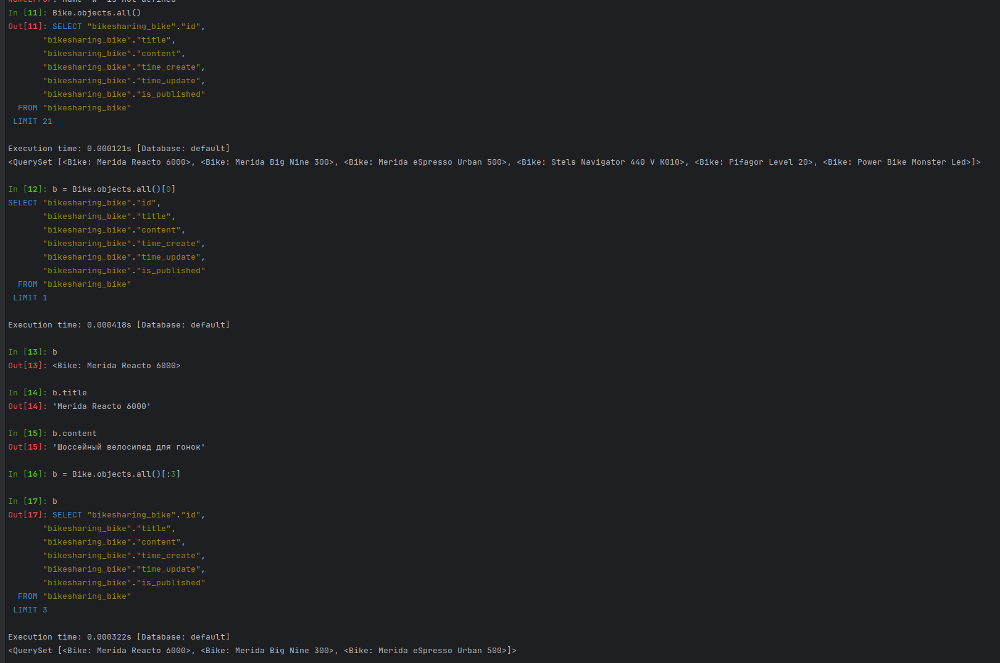
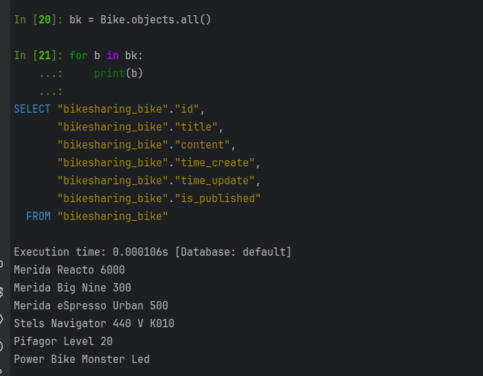
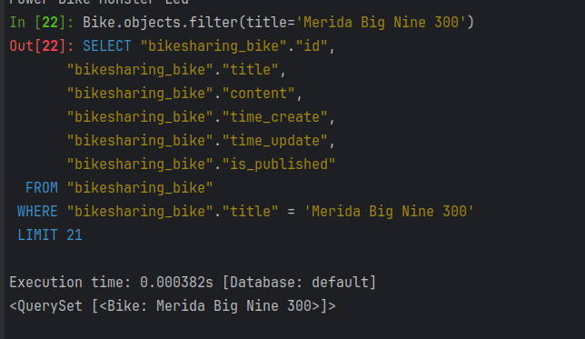
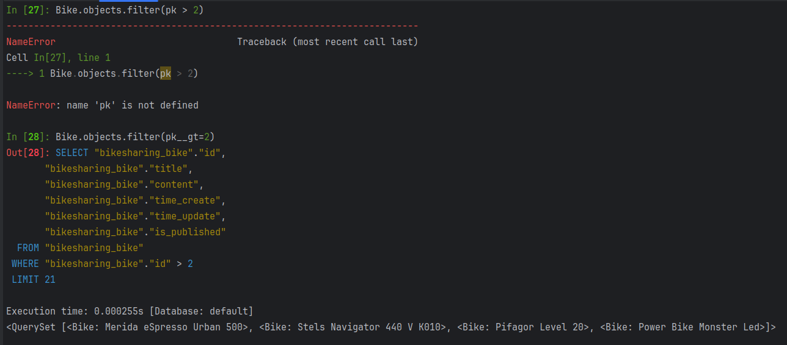
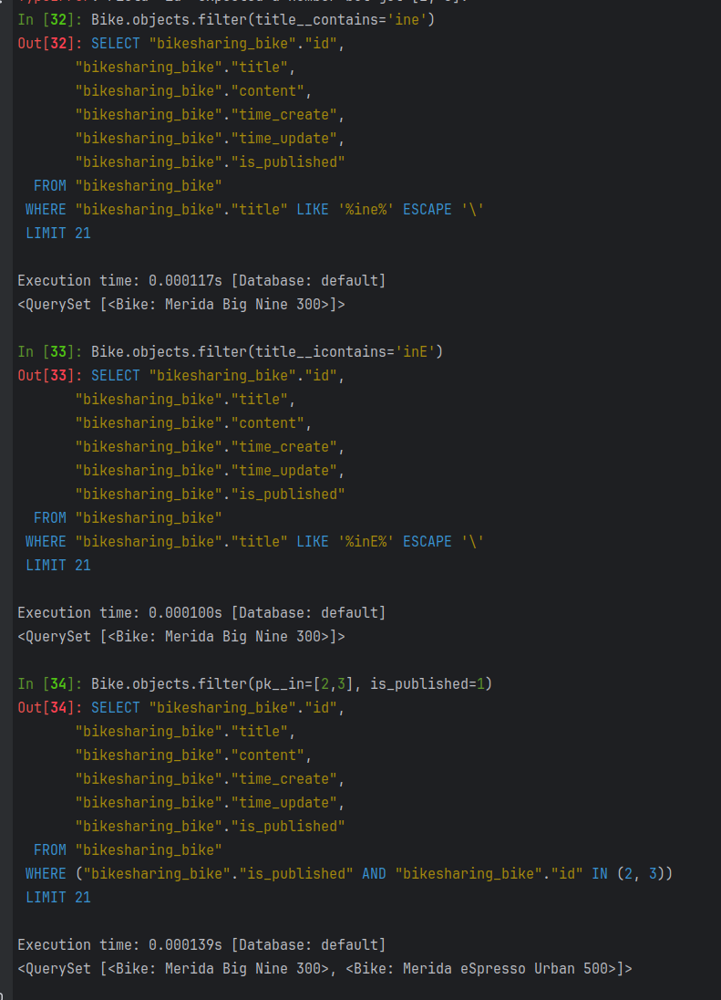
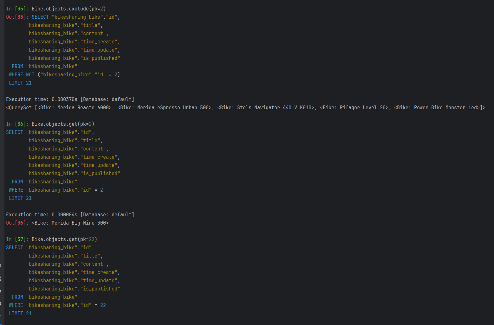

При помощи команды python bikesharing_site/manage.py shell_plus --print-sql
Открывает оболочку для работы с БД, флаг позволяет видеть команды SQL
Создаем объект Bike
Командой create сразу заполняем и сохраняем запись в таблице без использования .save()

Создание магического метода для читаемого вывода полей

С помощью команды
Bike.objects.all()
Можем посмотреть все записи в таблице

Команда
Bike.objects.all()[0]
выводит только одну запись эквивалентно LIMIT 1

Операции по обращению к полям объекта

Получение слайса первых трех объектов

И вывод их

Отображение полей в цикле

Отображать эффективнее при помощи filter(...) а не all() аналогично WHERE

В Django ORM условия фильтрации нужно передавать как именованные аргументы или использовать специальные объекты Q

Различные операции работы с БД

Различные операции работы с БД
