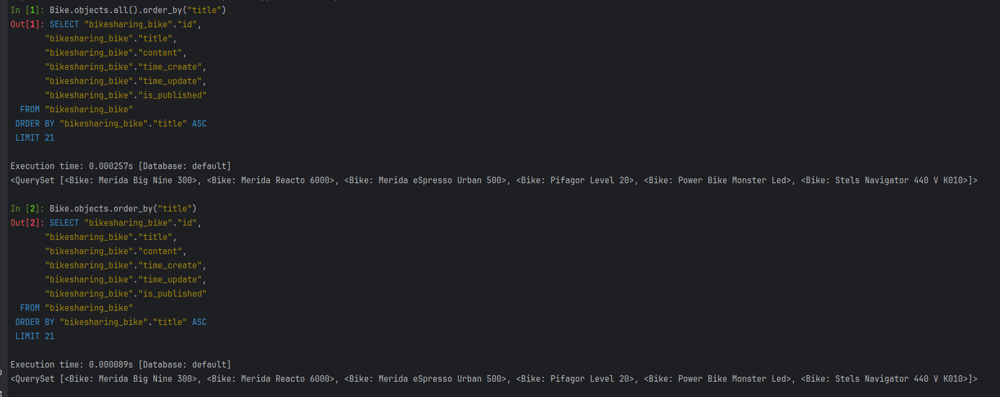
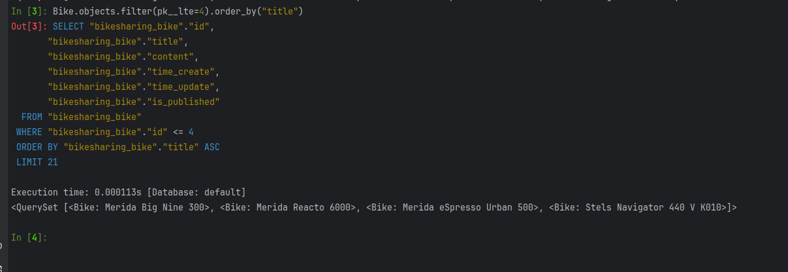
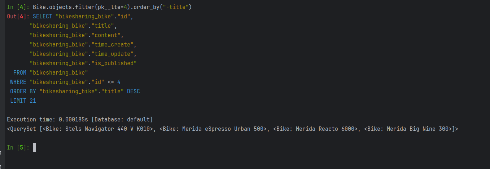
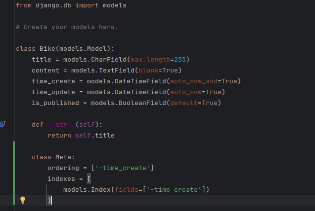
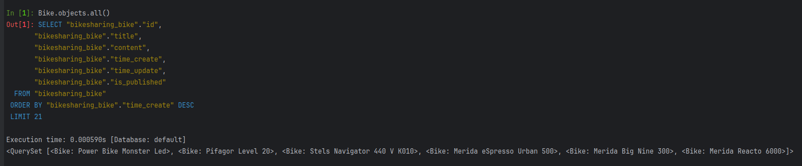
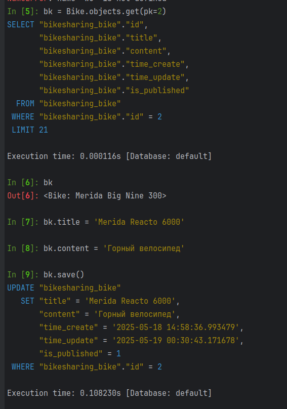
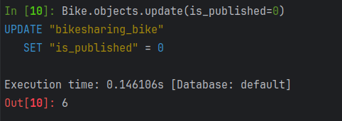
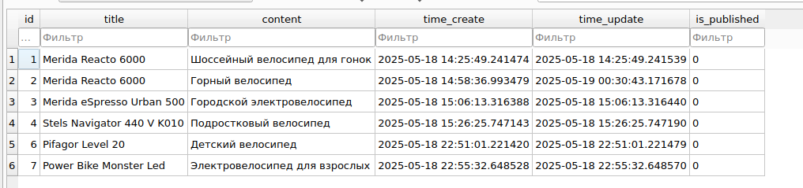
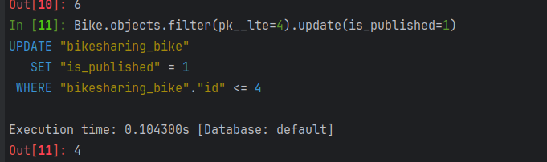
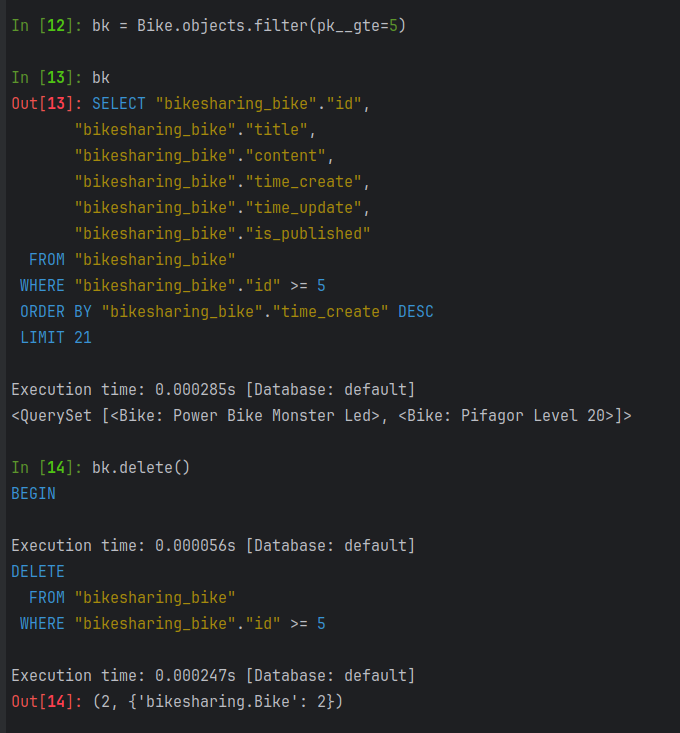

Сортировка

Вызов цепочки команд

Сортировка по убыванию

Настройка дефолтной сортировки по времени создания

Демонстрация

Изменение записей

Изменение сразу нескольких атрибутов

Обновление лишь нескольких значений в БД (update не применяется к срезам и к одиночным записям)

Удаление записей
