Изменение функции show_post для отображения slug
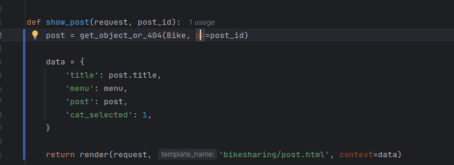

Добавление еще одного поля slug
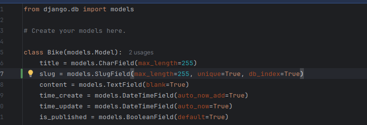

С помощью команды
python bikesharing_site/manage.py makemigrations
Осуществляет миграцию

Изменение файла миграции для того чтобы удалось создать таблицу без уникальности
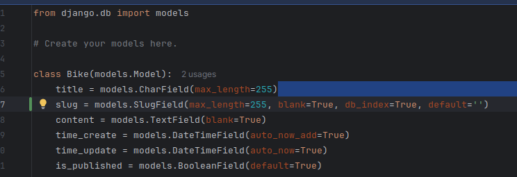

Создание миграции и её осуществление
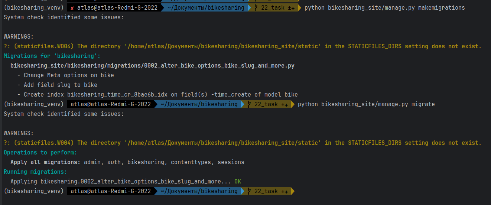

Добавление уникального slug`а через цикл
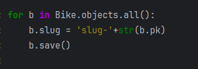

Демонстрация
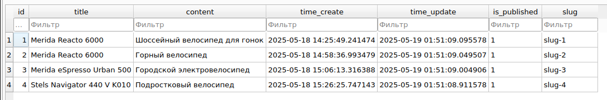

Возвращение предыдущего вида файла миграции

Изменение views.py и urls.py для отображения страницы по slug`y
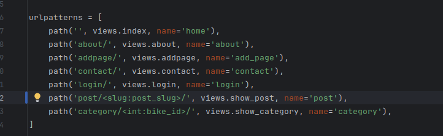
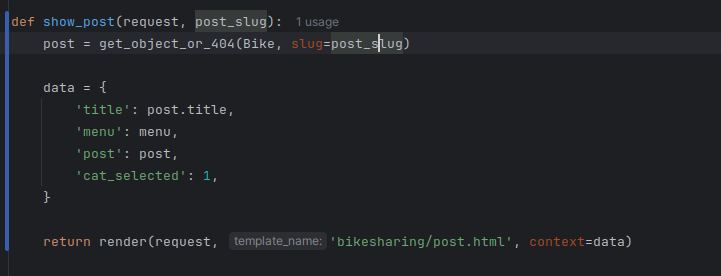

Создание нового метода для возвращения url адрес
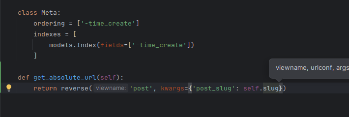

Изменение index.html для правильного отображение url
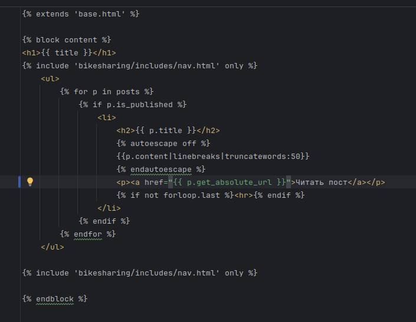

Изменение views.py для отображения статьи при переходе по ссылке
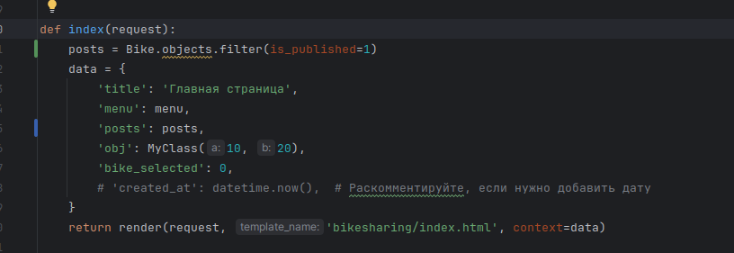

Результат
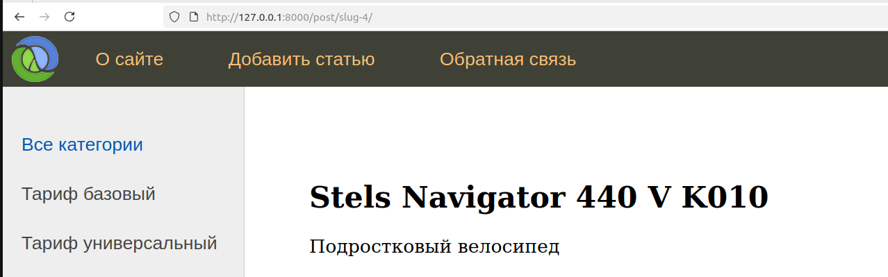