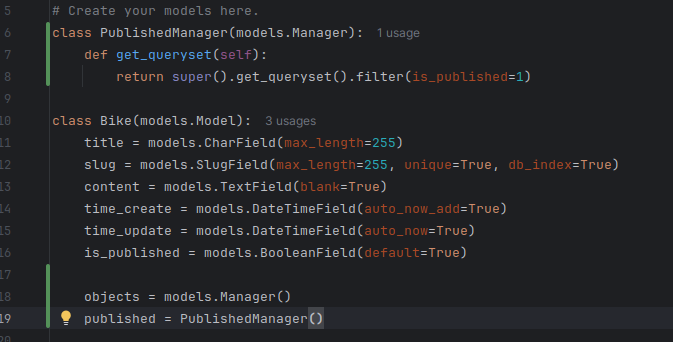
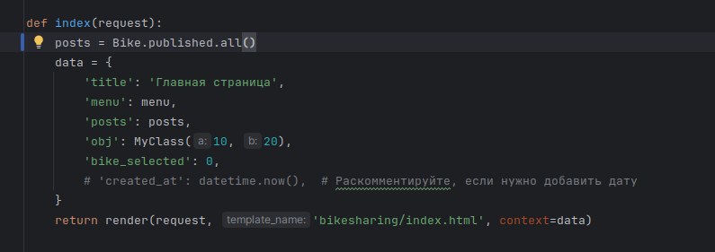
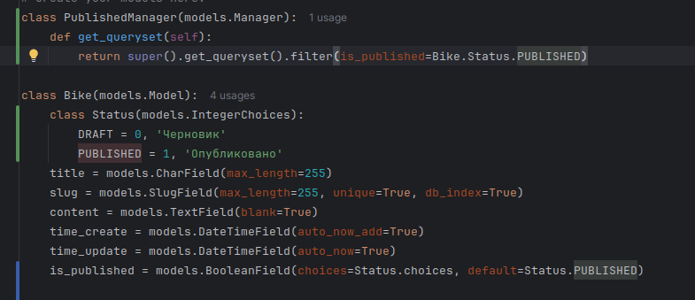
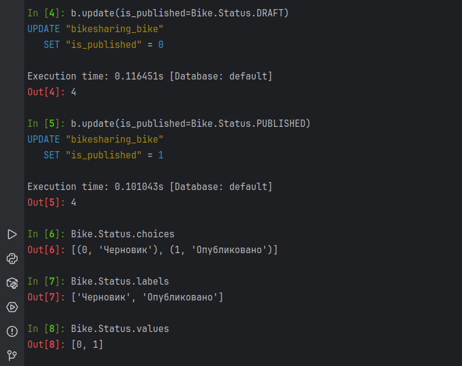

Создание своего собственного менеджера

Использование собственного менеджера

Теперь в index.html можно убрать проверку на published

Избавление от магических чисел при помощи Status

Обновление всех статей на не опубликованные
Обновление всех статей на опубликованные
Отображение всего кортежа
Отображение названий в кортеже
Отображение значений в кортеже
